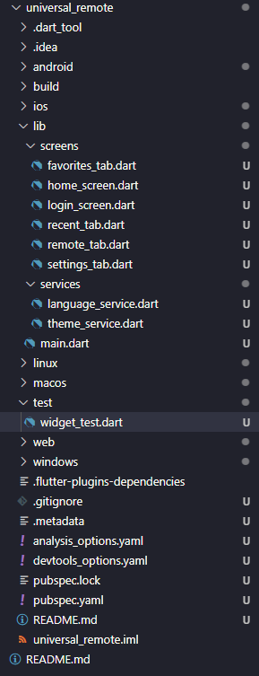

# 🎓 PAP - App móvel para Facilitar o uso da TV  

## 👤 Informação do Aluno
**Nome:** Emilio Pires da Silva  
**Número:** 5  
**Curso:** Profissional de Informática - Sistemas
**Ano Letivo:** 2025/2026 
**Orientador:** prof. Patricia Carvalhais, prof. Diana Carneiro e prof. Rosa Maria

## 📋 Descrição do Projeto
Desenvolver um sistema de controlo remoto para televisores através de uma aplicação móvel, utilizando botões virtuais e comandos de voz, em conjunto com um dispositivo externo baseado em Raspberry Pi com emissor de infravermelhos.

## 🎯 Objetivos Principais
- [ ] Desenvolver uma aplicação dinamica
- [ ] Implementar sistema de autenticação de utilizadores
- [ ] Criar interface responsiva e intuitiva
- [ ] Integrar reconhecimento de voz na app
- [ ] Implementar um servidor na Raspberry Pi 

## 🛠️ Stack Tecnológica

### **Frontend**
- [ ] Dart

### **Backend**
- [ ] Kotlin
- [ ] Raspberry PI OS
- [ ] Python & Flask
- [ ] LIRC

### **Base de Dados**
- [ ] MySQL

### **Outras Ferramentas**
- [ ] Git & GitHub
- [ ] VSCode
- [ ] Youtube/Documentos de aprendizagem

## 📁 Estrutura do Projeto

## 📊 *Funcionalidades Implementadas*

### ✅ Concluídas
- Frontend

### 🔄 Em Desenvolvimento
- Backend
- Base de dados
- Sistema de login

### 📅 Planeadas
- Implementação do servidor na Raspberry
- Comunicação IR 

## 🗓️ Plano de Trabalho
Fase	Tarefas	Prazo	Estado
1	Planeamento e setup	15/09	✅
2	Desenvolvimento frontend	01/10	🟡
3	Desenvolvimento backend	21/11	🔴
4	Testes e deploy	15/02	🔴

## 📝 Relatório de Progresso
Última Atualização: 28/10
O que foi feito desde a última atualização:
- Frontend

## Próximos passos:
- Backend
- Base de dados
- Sistema de Login

## 🔗 Links Úteis
- Documentação - Documentação detalhada
- Trello/Planeamento - Quadro de tarefas
- Protótipo - Design no Figma

## 📞 Contacto
- Email: [teu.email@escola.com]
- GitHub: [@teuusername]

